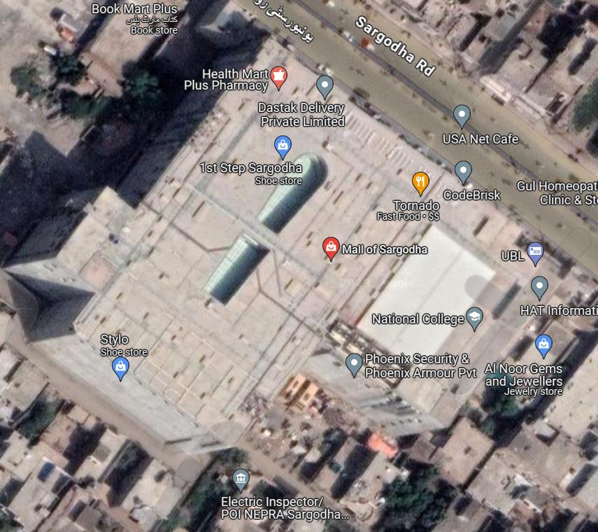
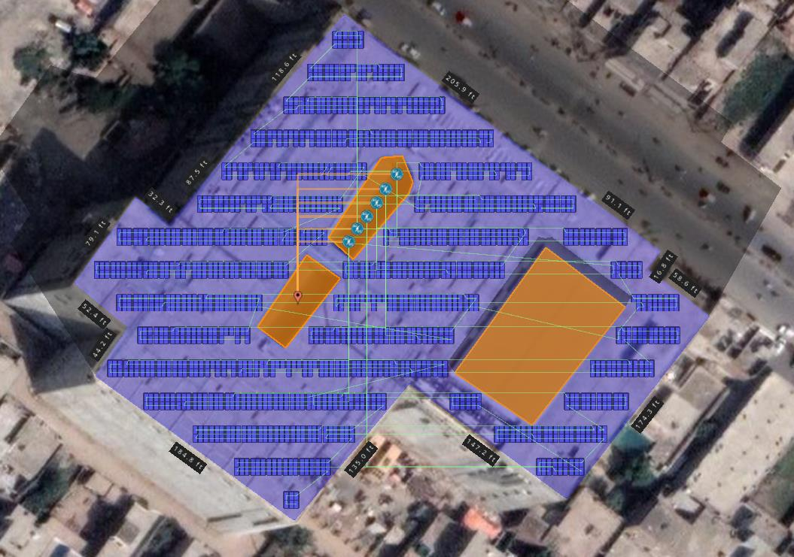
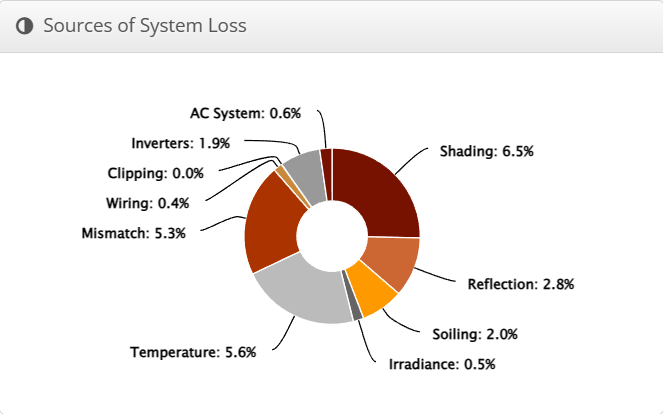
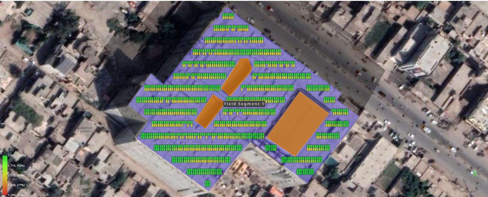
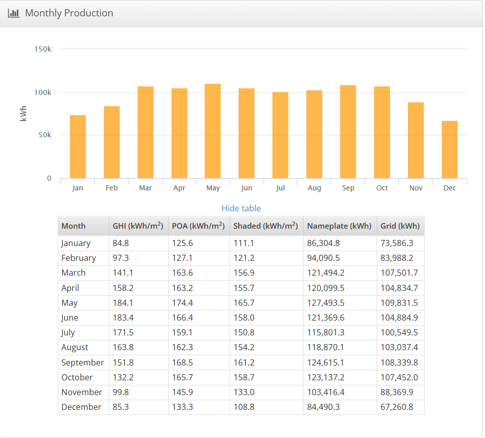
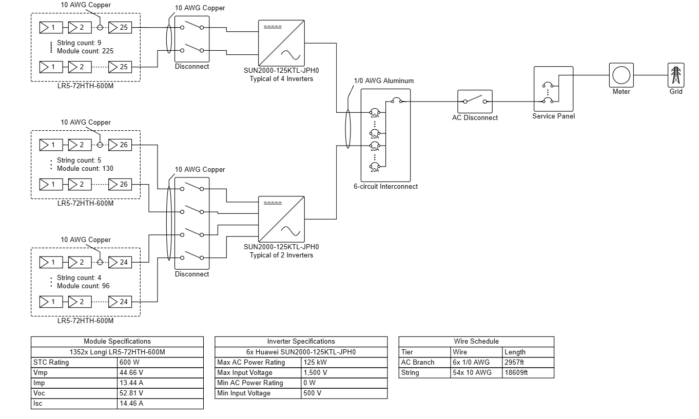

# Optimizing Solar Farm Placement and Energy Storage — Solar System Design for a Selected Load Center

A full rooftop solar PV design for the Mall of Sargodha, Sargodha — panel layout, stringing, inverter sizing, shading analysis, and annual energy yield — modeled in Helioscope as a Power Generation Complex Engineering Problem (CEP).

**Authors:** Muhammad Umer Mujahid, Muhammad Awais, Muhammad Zohaib Hassan, Muhammad Hassan, Hammad Nazir
**Course:** EE-419-L Power Generation Lab — Complex Engineering Problem (CEP)
**Instructor:** Dr. Faisal Masood · University of Engineering and Technology, Taxila · December 2023

## Objective

Design a solar PV system for the Mall of Sargodha, Sargodha, using Helioscope — from site selection and panel layout through shading analysis, stringing/inverter sizing, and annual production estimation.

## Background: Solar Panels, Inverters & Helioscope

The report covers the underlying PV theory before getting into the design: how solar panels convert sunlight to electricity via the photovoltaic effect, the four main panel technologies (monocrystalline, polycrystalline, PERC, and thin-film) and their tradeoffs, how a solar inverter converts panel DC output to usable AC, and the five common inverter types (battery, central, hybrid, string, and micro). It also introduces **Helioscope**, the Folsom Labs solar design platform used for the actual system design, and its four core modules — Mechanical (layout, tilt, spacing), Keepouts (excluding obstacles/shaded areas), Electrical (inverter sizing, stringing), and Advanced (shading and irradiance analysis) — along with key design terms like azimuth, tilt angle, stringing, and intra-row spacing.

## Site & System Design

**Site:** Mall of Sargodha, Sargodha — a roof with **98,582.6 ft²** of usable area and no adjacent-building shading, so sunlight falls directly across the whole surface.

**Design summary:**

| Parameter | Value |
|---|---|
| Module | Longi LR5-72HTH-600M (600 W) |
| Module count | 1,352 |
| DC nameplate | 811.2 kWp |
| Racking | Fixed tilt, 60 ft height |
| Azimuth / Tilt | 180° / 33° |
| Row spacing / GCR | 12.2 ft / 0.55 |
| Frame layout | 2 up × 3 wide, portrait orientation |
| Inverters | 6× Huawei SUN2000-125KTL-JPH0 |
| AC nameplate | 750.0 kW (1.08 DC/AC ratio) |
| Strings | 54× 10 AWG copper, 18,608.9 ft total |
| AC home runs | 6× 1/0 AWG aluminum, 2,957.4 ft total |

## Shading Analysis

Shading is one of the most important checks in a rooftop layout — a shaded cell doesn't just lose its own output, it can drag down the whole string it's part of. Helioscope's Advanced module models this per-module across a full year of weather data:

For this design, shading losses came in at **4.5%**, well within an acceptable range, with an estimated annual energy output of **1.41 GWh** at the field-segment level.

**Sources of system loss** (of the total derate from nameplate to delivered energy):

| Source | Loss |
|---|---|
| Shading | 6.5% |
| Temperature | 5.6% |
| Mismatch | 5.3% |
| Reflection | 2.8% |
| Soiling | 2.0% |
| Inverters | 1.9% |
| Irradiance | 0.5% |
| AC System | 0.6% |
| Wiring | 0.4% |
| Clipping | 0.0% |

## Energy Production

Monthly solar access ranged from **82% (December) to 96% (March/September)**, translating into a production curve that peaks in **May** and dips in **January and December**:

**Annual production summary:**

| Metric | Value |
|---|---|
| Annual GHI (global horizontal irradiance) | 1,653.2 kWh/m² |
| Total collector irradiance (POA, after losses) | 1,652.7 kWh/m² |
| Nameplate energy | 1,341,182.3 kWh |
| Energy to grid (after all derates) | 1,159,636.6 kWh (−0.6% vs. constrained DC output) |
| Avg. operating ambient / cell temperature | 26.6°C / 36.3°C |

## Electrical Design: Single Line Diagram

The array is split into three string groups — 225 modules over 9 strings, 130 modules over 5 strings, and 96 modules over 4 strings — feeding six Huawei inverters in total (four for the first group, two shared by the other two), then combined through a 6-circuit interconnect, AC disconnect, and service panel out to the meter and grid.

**Module electrical specs:** STC rating 600 W · Vmp 44.66 V · Imp 13.44 A · Voc 52.81 V · Isc 14.46 A
**Inverter specs:** Max AC power 125 kW · Max input voltage 1,500 V · Min input voltage 500 V

## Conclusion

The design installs a 1,352-panel, 811.2 kWp array across the Mall of Sargodha roof, with tilt, azimuth, stringing, and inverter sizing all tuned in Helioscope and shading losses verified at an acceptable 4.5%, delivering roughly 1.16 GWh/year to the grid.

## Tools

Helioscope (Folsom Labs) — PV layout, shading, and yield modeling

## Repository Contents

- `Solar System Design.pdf` — this report: PV/inverter theory, Helioscope walkthrough, site design, shading analysis, and production results for the Mall of Sargodha.
- `Solar System Design with Load Measurement.pdf` — companion report extending the design with load-side measurement (see file for details).
- `solar-site-location.png` — satellite view of the selected roof.
- `solar-field-design.png` — panel layout with wiring and inverter placement.
- `solar-shading-heatmap.png` — per-module shading analysis.
- `solar-system-loss-chart.png` — breakdown of system losses.
- `solar-monthly-production.png` — monthly energy production chart.
- `solar-single-line-diagram.png` — electrical single line diagram.
